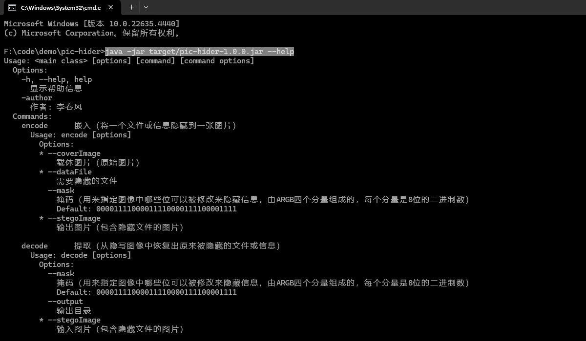

# 图片隐写工具

[](https://github.com/yhczyi/pic-hider)
[](https://opensource.org/licenses/MIT)

[](https://github.com/yhczyi/pic-hider)

## 介绍

`pic-hider`是一个用Java编写的命令行工具，用于将文件隐藏到图片中。该工具使用隐写技术，可以在不影响图片视觉效果的情况下嵌入文件数据。

### 应用场景
- 版权保护：在图像中嵌入版权信息
- 数据传输：在网络通信中隐藏敏感信息或用于秘密通信

### 功能特性
- [x] 恢复原始文件名：支持提取文件时恢复出原始文件名
- [x] 自定义掩码：支持根据掩码自定义图片中哪些位可以嵌入隐藏信息
- [ ] 生成载体图片：支持载体图片为空时可默认生成载体图片
- [ ] 数据加密：支持对嵌入的数据文件加密

## 目录

- [安装](#安装)
- [原理与掩码示例](#原理与掩码示例)
- [使用帮助](#使用帮助)
- [操作示例](#操作示例)

## 安装

- [Git](https://git-scm.com/)
- [Java17](http://www.oracle.com/technetwork/java/javase/downloads/index.html)
- [Maven](http://maven.apache.org/)

```bash
   git clone https://github.com/yhczyi/pic-hider.git
   cd pic-hider
   mvn clean package
```

## 原理与掩码示例
采用`最低有效位（Least Significant Bit, LSB）替换法`在每个像素的最低有效位上嵌入秘密信息，由于最低有效位的变化对颜色值的影响非常小，人眼通常无法察觉这种微小的变化。  
对于彩色图像，每个像素包含3个颜色通道（红、绿、蓝）有时会出现第4个通道 即`Alpha通道`用于表示透明度，每个通道由8位表示。在不明显改变图像外观的前提下，将秘密信息的二进制位替换成像素的最低有效位。

### 示例
假设我们有一个3通道颜色`rgb(170,187,204)`的像素值为`0xAABBCC`，即`101010101011101111001100`。我们需要在这个像素中嵌入一个3位的秘密信息`101`。使用掩码`000000010000000100000001`

掩码`"000000010000000100000001"`的含义
- Red、Green、Blue三个通道的最高7位不被修改，最低1位用于隐藏信息

```plaintext
Pixel Value:   00000000101010101011101111001100
Mask:          00000000000000010000000100000001
Result:        00000000101010111011101011001101
```
1. 原始像素值：
    - 红色通道 (R): 10101010
    - 绿色通道 (G): 10111011
    - 蓝色通道 (B): 11001100
2. 秘密信息：  
    - 第1位: 1
    - 第2位: 0
    - 第3位: 1
3. 嵌入过程：
    - 将红色通道的最低1位有效位从 0 改为 1，变为 10101011
    - 将绿色通道的最低1位有效位从 1 改为 0，变为 10111010
    - 将蓝色通道的最低1位有效位从 0 改为 1，变为 11001101
4. 嵌入后的像素值：
    - 红色通道 (R): 10101011
    - 绿色通道 (G): 10111010
    - 蓝色通道 (B): 11001101
    - 新的像素值由 `0xAABBCC`对应颜色`rgb(170,187,204)` 变为 `0xABBACD`对应颜色`rgb(171,186,205)`

### 优点
- 隐蔽性高：由于最低有效位的变化对视觉影响很小，很难被肉眼察觉

### 缺点
- 容量有限：每个像素只能存储少量的信息，因此整个图像的隐藏容量相对较小

## 使用帮助

- 命令
```bash
java -jar target/pic-hider-1.0.0.jar --help
```


## 操作示例

### 嵌入文件

假设你电脑桌面`PicHider`目录下有一个名为`1920-1080.png`的图片和一个名为`data.zip`的文件。你可以使用以下命令将`data.zip`隐藏到`1920-1080.png`图片中。注：不会修改原图，会新产生`1920-1080-嵌入后.png`图片，该图片中包含隐藏文件

- 命令
```bash
java -jar target/pic-hider-1.0.0.jar encode --dataFile "C:\\Users\\Administrator\\Desktop\\PicHider\\data.zip" --coverImage "C:\\Users\\Administrator\\Desktop\\PicHider\\1920-1080.png" --stegoImage "C:\\Users\\Administrator\\Desktop\\PicHider\\1920-1080-嵌入后.png"
```

### 提取文件

假设你电脑桌面`PicHider`目录有一个名为`1920-1080-嵌入后.png`的图片文件，其中隐藏了一个文件。你可以使用以下命令提取出隐藏文件：
- 命令
```bash
java -jar target/pic-hider-1.0.0.jar decode --stegoImage "C:\\Users\\Administrator\\Desktop\\PicHider\\1920-1080-嵌入后.png" --output "C:\\Users\\Administrator\\Desktop\\PicHider"
```

---
[回到最上面](#图片隐写工具)
